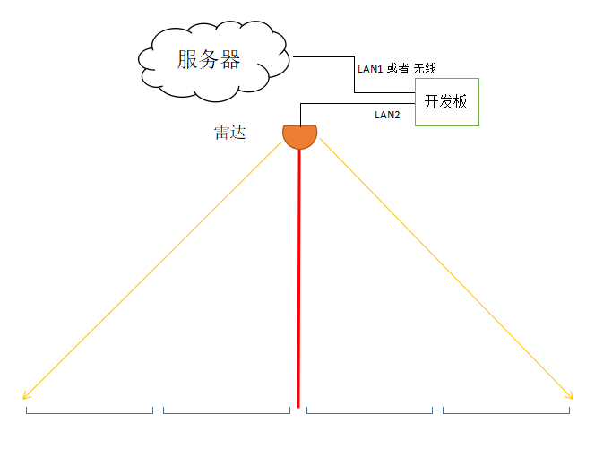
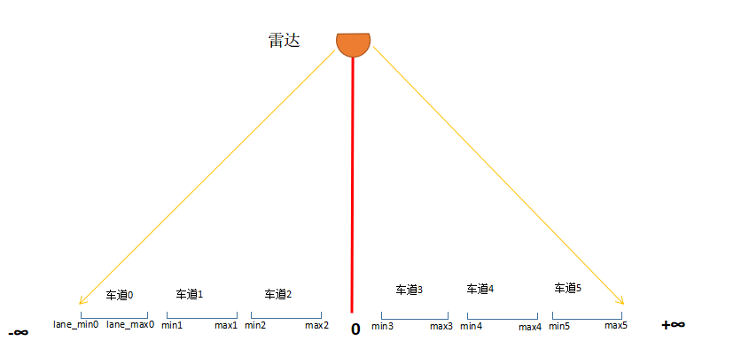

= 雷达识别车辆开发板上程序说明
Mu HongYun <muhongyun@gmail.com>
1.0, 05 05, 2018
:toc:

== 1 安装工作 

=== 1.1 安装配置雷达
. 安装高度6到8米
. 雷达正对路面，保证扫描平面与路面平行
. 固定雷达ip及port
. 雷达扫描频率50hz

=== 1.2 车道测量
雷达与路面垂直的交点为0点,测量各车道两条边线到交点的最短距离

=== 1.3 开发版环境配置
. windows linux系统不限
. 包含完整python2.7运行环境
. 具备一个网口同雷达连接 
. 额外的网口或者wifi连接上网，以便上传数据，调试，监控

=== 1.4 配置基础参数
. 配置各车道左右边沿参数
. 配置各车道水平高度参数
** 水平高度
. 配置上传服务器地址及端口
. 配置雷达ip及port
. 长度高度坐标度量均为厘米
[source, json]
{
    "lane_horizon": [
        605,
        598,
        600,
        600,
        600,
        600
    ],
    "lane_min": [
        -1230,
        -850,
        -490,
        310,
        640,
        1100
    ],
    "lane_max": [
        -1000,
        -500,
        -200,
        600,
        1000,
        1300
    ],
    "threshold_num": 2,
    "threshold_height": 32,
    "car_threshold": 60,
    "host": "192.168.1.25",
    "port": 25
}

== 2 开发板程序说明

=== 2.1 雷达驱动 lidar.py
单独一个进程负责与雷达通信，连续读取雷达数据，将雷达数据发送给线程通信队列

=== 2.2 雷达扫描帧解析 frame.py
从线程通信队列中连续读取雷达数据，将雷达数据转换成二维坐标，进而提取出当前车道扫描到车辆的最高点，将车辆高度数据发送给线程通信队列

=== 2.3 车辆特征参数提取 analysis.py
从线程通信队列中连续读取车辆数据，对车辆数据进行分析分型，再通过网络将结果转发给服务器

=== 2.4 车型分析算法说明
从雷达扫描帧数据得到车辆波形，从而分析出车辆经过时占用的雷达周期数，最高高度，平均高度，高度方差，平均宽度等数据
与9类车辆典型数据做匹配，匹配度最高的车型即为当前扫描的车辆的车型

== 3 使用与维护

=== 3.1 进程监控脚本 daemon.sh
监控雷达进程，正常情况下雷达有三个python start.py进程，若发现当前系统python start.py进程数少于三个，杀掉当前雷达程序进程，然后重启,daemon.sh添加到local.rc系统脚本，开机即启动

=== 3.2 开发板内网穿透服务配置
通过 https://github.com/fatedier/frp[frp] 配置内网穿透服务

=== 3.3 参数远程更新与配置
frp参数配置好之后能够远程访问开发板，通过编辑lidar.json数据修改雷达参数